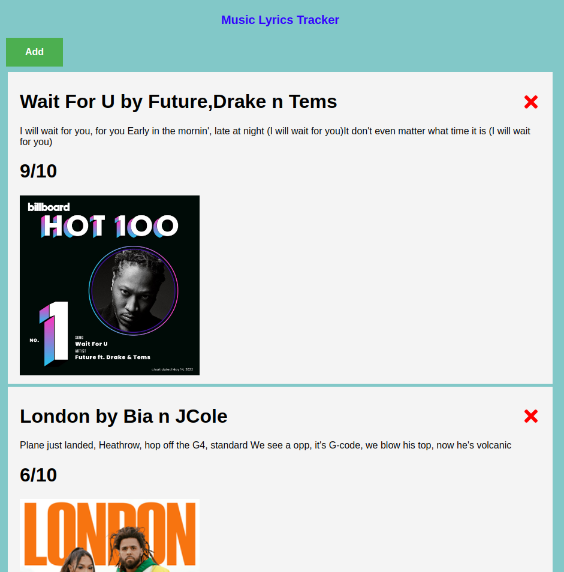

# Music Lyrics App

## By Bryan Bosire

### Landing page

### Design Page

# Live Link

Click this link [https://react-music-app1.netlify.app/](https://react-music-app1.netlify.app/) to view the live website.

## Description

This is a music lyric app that lets the user add new music lyrics according to his/her taste and preference.In the long run the user can keep track of different music and their ratings according to posted lyrics.Lyrics are like a poem lines for me,they are educative and soothing.The project was deployed to Netlify and It allows for Continous Deployment. 

# Getting Started with Create React App

This project was bootstrapped with [Create React App](https://github.com/facebook/create-react-app).

## Available Scripts

In the project directory, you can run:

### `npm start`

Runs the app in the development mode.\
Open [http://localhost:3000](http://localhost:3000) to view it in your browser.

The page will reload when you make changes.\
You may also see any lint errors in the console.

### `npm test`

Launches the test runner in the interactive watch mode.\
See the section about [running tests](https://facebook.github.io/create-react-app/docs/running-tests) for more information.

### `npm run build`

Builds the app for production to the `build` folder.\
It correctly bundles React in production mode and optimizes the build for the best performance.

The build is minified and the filenames include the hashes.\
Your app is ready to be deployed!

See the section about [deployment](https://facebook.github.io/create-react-app/docs/deployment) for more information.

## Learn More

You can learn more in the [Create React App documentation](https://facebook.github.io/create-react-app/docs/getting-started).

To learn React, check out the [React documentation](https://reactjs.org/).

## License

MIT License

Copyright (c) [2022] [Bryan Bosire]
